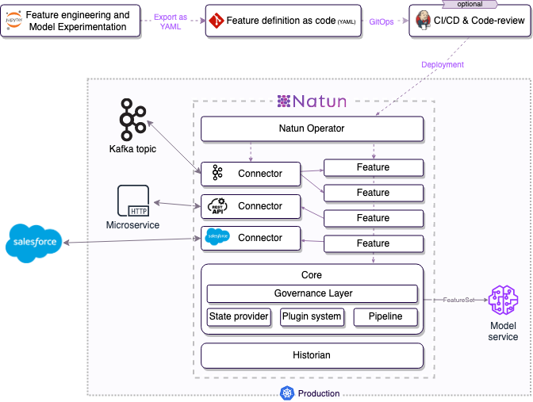

<div id="top"></div>

[![Go Report Card][go-report-card-shield]][go-report-card-url]
[![Go Reference][godoc-shield]][godoc-url]
[![Contributors][contributors-shield]][contributors-url]
[![Forks][forks-shield]][forks-url]
[![Stargazers][stars-shield]][stars-url]
[![Issues][issues-shield]][issues-url]
[![MIT License][license-shield]][license-url]
[![LinkedIn][linkedin-shield]][linkedin-url]

<br />
<div align="center">
  <a href="https://github.com/natun-ai/natun">
    
  </a>
  
  <h3 align="center">Serverless feature engineering - from notebook to production</h3>

  <p align="center">
    Build production-ready ML features, directly from your notebook, without being a software engineer. <br />
    Focus on <strong>data science</strong>, Natun will take care of the engineering overhead.
    <br />
    <br />
    <a href="https://docs.natun.ai"><strong>Explore the docs »</strong></a>
    <br />
    <br />
    <a href="https://github.com/natun-ai/natun">Getting started in 5 minutes</a>
    ·
    <a href="https://github.com/natun-ai/natun/issues">Report Bug</a>
    ·
    <a href="https://github.com/natun-ai/natun/issues">Request Feature</a>
  </p>
</div>

[![Natun Screen Shot][product-screenshot]][docs-url]

## 🧐 What is Natun?

With Natun, Data Scientists can write ML Features that can work in production directly in your notebook and deploy
them to production on their own (yes! without going through the engineering team). **It's like writing Lambda for Feature Engineering.**

After developing your ML features, deploy them to your Kubernetes, and the Natun extension will take care of the
production concerns (such as scale, high availability, authentication, caching, monitoring, etc.)

[![Colab][colab-button]][colab-url]

### 😍 Why people *love* Natun?
 * **Data Scientists** love Natun because it's easy to use and make a use of their work.
   No more excuses from the engineering team!
 * **DevOps teams** love Natun because it's **built on top of Kubernetes**, leveraging their standard stack, and it's
   *ridiculously* easy to deploy and manage (because of Kubernetes, duh?).

And what about the engineers? Well, it's finally taking away this "burden"  from them.

### ⭐️ Features
 * **Same code for both training and production**<br/>
    You can run the same Natun compatible features in training and production and prevent the *training serving skew*.
 * **Real-Time / On-demand feature calculation**<br/>
    Natun is optimizing features to be calculated at the time of the request.
 * **Caching and storing**<br/>
    Natun is utilizing an integrated Feature-Store to cache the calculation results and take snapshots of the data
    to cold storage for historical purposes (such as re-training).
 * **Pluggable**<br/>
    Natun is highly-pluggable. Technically, you can even bring your own feature store implementation.
 * **Kubernetes Native and Standards**<br/>
    Natun is implementing by-design functionalities of Kubernetes such as leader-election, scaling, health, auto-recovery,
    monitoring and logging.


<p align="right">(<a href="#top">back to top</a>)</p>

## 💡 How does it work?
Natun is extending Kubernetes to serve Natun-compatible features in a production-grade manner.
It's implementing the "Kubernetes Way," which advocates for writing the desired state and allows you to
**focus on writing** the business logic.

Natun takes care of the engineering concerns of implementing the "desired state" by managing and
controlling Kubernetes-native resources such as deployments to connect your production data-sources and to run your
business logic at scale.



Behind the scenes, Natun is attaching the proper building block to implement the "production behavior" of your use-case
(i.e., streaming, REST API, gRPC, expression, etc.).

You can read more about Natun's architecture in [the docs][docs-url].

## ⚡️ Quick start

The LabSDK is the quickest and most popular way to develop Natun compatible features.

[![Colab][colab-button]][colab-url]

The LabSDK allows you to write Natun-compatible features using Python and "convert" them to Kubernetes resources.
This way, in most of the use-cases, you can iterate and play with your data.


### Production Installation
**Natun installation is not required for training purposes**.
You only need to install Natun *when deploying to production* (or staging).

Because Natun
#### Prerequisites
1. Kubernetes cluster

   (You can use [Kind](https://kind.sigs.k8s.io/) to install Natun locally)
2. `kubectl` installed and configured to your cluster.
3. Redis server

   ⚠️ *Tip: You can also use a managed Redis solution such as [AWS ElasticCache](https://aws.amazon.com/elasticache/)
   or [GCP Memorystore](https://cloud.google.com/memorystore), or via the [K8s Redis Operator](https://operatorhub.io/operator/redis-operator)*

### Installation
The easiest way to install Natun is to use the [OperatorHub Installation method](https://operatorhub.io/operator/natun).

<p align="right">(<a href="#top">back to top</a>)</p>


## 🌍 "Hello World" feature
We know, you played with [the quick starter][colab-url] already.. But let's paste here some "hello world" code
for the lazy bastard out there 👹

_For more examples, please refer to the [Documentation][docs-url]_

### Option 1: Using LabSDK
```python
@natun.register(str, freshness="1m", staleness="15m")
def hello_world(**req : NatunRequest):
  return "hello "+req["entity_id"]+"!"
```
### Option 2: Natun compatible Feature (the Kubernetes native way)
The code below, is actually the results of Option 1 above 🤪
But in case you've decided to not use the LabSDK, you can write a Feature Definition like this:

```yaml
apiVersion: k8s.natun.ai/v1alpha1
    kind: Feature
    metadata:
      name: hello_world
    spec:
      primitive: string
      freshness: 1m
      staleness: 15m
      builder:
        kind: expression
    pyexp: |
      def hello_world(**req):
          return 'hello ' + req['entity_id']) + '!'
```

<p align="right">(<a href="#top">back to top</a>)</p>


<!-- ROADMAP -->

## 🏔 Roadmap

- [x] Redis state provider
- [x] Snowflake historical storage plugin
- [ ] S3 historical storage plugins
  - [x] S3 storing
  - [ ] S3 fetching data - Spark
- [ ] KServe Integration
- [ ] Seldon Integration
- [ ] Scheduler builder

See the [open issues](https://github.com/natun-ai/natun/issues) for a full list of proposed features (and known issues).

<p align="right">(<a href="#top">back to top</a>)</p>


<!-- CONTRIBUTING -->

## 👷‍ Contributing

Contributions make the open-source community a fantastic place to learn, inspire, and create. Any contributions you make are **greatly appreciated** (not only code! but also documenting, blogging, or giving us feedback) 😍.

Please fork the repo and create a pull request if you have a suggestion. You can also simply open an issue and choose "Feature Request" to give us some feedback.

**Don't forget to give the project a star! ⭐️**

For more information about contributing code to the project, read the `CONTRIBUTING.md` file.

<p align="right">(<a href="#top">back to top</a>)</p>


<!-- LICENSE -->

## 📃 License

Distributed under the Apache2 License. Read the `LICENSE` file for more information.

<p align="right">(<a href="#top">back to top</a>)</p>


## 👫 Joining the community


<p align="right">(<a href="#top">back to top</a>)</p>

[godoc-shield]: https://pkg.go.dev/badge/github.com/natun-ai/natun.svg
[godoc-url]: https://pkg.go.dev/github.com/natun-ai/natun

[contributors-shield]: https://img.shields.io/github/contributors/natun-ai/natun.svg?style=flat
[contributors-url]: https://github.com/natun-ai/natun/graphs/contributors

[forks-shield]: https://img.shields.io/github/forks/natun-ai/natun.svg?style=flat
[forks-url]: https://github.com/natun-ai/natun/network/members

[stars-shield]: https://img.shields.io/github/stars/natun-ai/natun.svg?style=flat
[stars-url]: https://github.com/natun-ai/natun/stargazers

[issues-shield]: https://img.shields.io/github/issues/natun-ai/natun.svg?style=flat
[issues-url]: https://github.com/natun-ai/natun/issues

[license-shield]: https://img.shields.io/github/license/natun-ai/natun.svg?style=flat
[license-url]: https://github.com/natun-ai/natun/blob/master/LICENSE.txt

[linkedin-shield]: https://img.shields.io/badge/-LinkedIn-black.svg?style=flat&logo=linkedin&colorB=555
[linkedin-url]: https://linkedin.com/in/natun-ai

[go-report-card-shield]: https://goreportcard.com/badge/github.com/natun-ai/natun
[go-report-card-url]: https://goreportcard.com/report/github.com/natun-ai/natun

[product-screenshot]: .github/demo.svg

[colab-button]: https://img.shields.io/badge/-Getting%20started%20with%20Colab-blue?style=for-the-badge&logo=googlecolab
[colab-url]: https://colab.research.google.com/github/natun-ai/docs/blob/master/docs/getting-started-with-labsdk.ipynb

[docs-url]: https://docs.natun.ai/