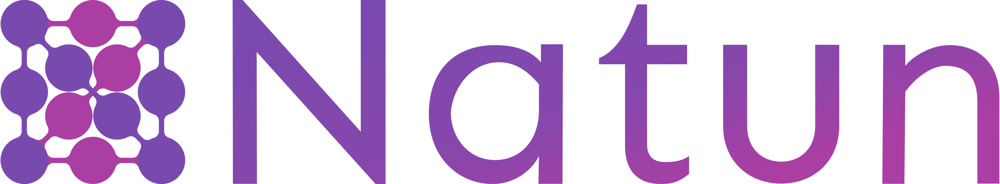

<div id="top"></div>

[![Go Report Card][go-report-card-shield]][go-report-card-url]
[![Go Reference][godoc-shield]][godoc-url]
[![E2E Tests][e2e-tests-shield]][e2e-tests-url]
[![CII Best Practices][best-practices-shield]][best-practices-url]
[![Forks][forks-shield]][forks-url]
[![Stargazers][stars-shield]][stars-url]
[![Issues][issues-shield]][issues-url]
[![MIT License][license-shield]][license-url]
[![LinkedIn][linkedin-shield]][linkedin-url]
<!-- [![Contributors][contributors-shield]][contributors-url] -->

<br />
<div align="center">
  <a href="https://github.com/raptor-ml/raptor">
    
  </a>

<h3 align="center">Serverless feature engineering - from notebook to production</h3>

  <p align="center">
    Build production-ready ML features, directly from your notebook, without being a software engineer. <br />
    Focus on <strong>data science</strong>, RaptorML will take care of the engineering overhead.
    <br />
    <br />
    <a href="https://raptor.ml"><strong>Explore the docs »</strong></a>
    <br />
    <br />
    <a href="https://colab.research.google.com/github/raptor-ml/docs/blob/master/docs/guides/getting-started-with-labsdk.ipynb">Getting started in 5 minutes</a>
    ·
    <a href="https://github.com/raptor-ml/raptor/issues">Report a Bug</a>
    ·
    <a href="https://github.com/raptor-ml/raptor/issues">Request a Feature</a>
  </p>
</div>

[![RaptorML Screen Shot][product-screenshot]][docs-url]

## 🧐 What is Raptor?

With Raptor, data scientists can stop waiting for others to build production-ready version of their work. Instead,
slightly
tweak your Python code and write your features' code in a notebook. Then, export the features to Kubernetes, and
RaptorML will take care of the production and engineering concerns (such as scale, high availability, authentication,
caching, monitoring, etc.)

[![Colab][colab-button]][colab-url]

### 😍 Why people *love* Raptor?

* **Data Scientists** love Raptor because it's _easy to use_ and let them make _impact_ with their work _swiftly_.
  No more excuses from other teams!
* **DevOps teams** love Raptor because it's **built on top of Kubernetes**, leveraging their standard stack, and it's
  *ridiculously* easy to deploy and manage (because of Kubernetes, duh?).

### ⭐️ Key Features

* **Same code for both training and production**<br/>
  You can run the same Raptor compatible features in training and production and prevent the *training serving skew*.
* **Real-Time / On-demand feature calculation**<br/>
  Raptor is optimizing features to be calculated at the time of the request.
* **Caching and storing**<br/>
  Raptor is utilizing an integrated "Reversed Feature-Store" to cache the calculation results and take snapshots of the
  data to cold storage for historical purposes (such as re-training).
* **Pluggable**<br/>
  Raptor is highly-pluggable. You can even bring your own storage implementation.
* **Kubernetes Native and Best-practices Standards**<br/>
  Raptor is implementing by-design best-practices functionalities of Kubernetes solutions such as leader-election,
  scaling, health, auto-recovery, monitoring, logging, and more.

<p align="right">(<a href="#top">back to top</a>)</p>

## 💡 How does it work?

Raptor allows you to write your ML features in a way that can be translated for production purposes.
Features in Raptor are composed a declarative part(via Python's decorators) and a function code. This way, we can
instruct the "Raptor Core" to implement the "declarative part" and optimize the implementation for production.

![Features are composed from a declarative part and a function code][feature-py-def]

After you are satisfied with the results, you can "export" these definitions to Kubernetes and deploy them using
standard tools; Once deployed, Raptor Core(the server-side part) is extending Kubernetes with the ability to
implement them. It takes care of the engineering concerns by managing and controlling Kubernetes-native resources such
as deployments to connect your production data sources and run your business logic at scale.

You can read more about Raptor's architecture in [the docs][docs-url].

## ⚡️ Quick start

Raptor's LabSDK is the quickest and most popular way to develop RaptorML compatible features.

[![Colab][colab-button]][colab-url]

The LabSDK allows you to write Raptor-compatible features using Python and "convert" them to Kubernetes resources.
This way, in most of the use-cases, you can iterate and play with your data.

### Production Installation

**Raptor installation is not required for training purposes**.
You only need to install Raptor *when deploying to production* (or staging).

Learn more about production installation at [the docs][docs-url].

#### Prerequisites

1. Kubernetes cluster

   (You can use [Kind](https://kind.sigs.k8s.io/) to install Raptor locally)
2. `kubectl` installed and configured to your cluster.
3. Redis server (> 2.8.9)

### Installation

The easiest way to install Raptor is to use
the [OperatorHub Installation method](https://operatorhub.io/operator/raptor).

<p align="right">(<a href="#top">back to top</a>)</p>

## 🌍 "Hello World" feature

We know, you played with [the quick starter][colab-url] already, but let's paste here some "hello world" code
for the lazy bastard out there 👹

_For more examples, please refer to the [Documentation][docs-url]_

### Hello world using the LabSDK

The following code will create a feature that will return `Hello <name>!` when called, where <name> is the `entity_id`
passed as an argument via the `**kwargs` parameter.

```python
@raptor.register(str, freshness="1m", staleness="15m")
def hello_world(**req: RaptorRequest):
    return "hello " + req["entity_id"] + "!"
```

To train our data with it, we can "replay" the feature with the following code:

```python
import pandas as pd

df = pd.DataFrame({"entity_id": ["John", "Jane", "Joe"]})
hello_world.replay(df)
```

To export the feature to Kubernetes, we can use the `manifest()` method:

```python
print(hello_world.manifest())
```

Then, we can deploy the generated manifest to the cluster
using [`kubectl`](https://kubernetes.io/docs/reference/kubectl/) or with our CI/CD.

<p align="right">(<a href="#top">back to top</a>)</p>


<!-- ROADMAP -->

## 🏔 Roadmap

- [x] Redis state provider
- [x] Snowflake historical storage plugin
- [ ] S3 historical storage plugins
    - [x] S3 storing
    - [ ] S3 fetching data - Spark
- [ ] KServe Integration
- [ ] Seldon Integration
- [ ] Scheduler builder

See the [open issues](https://github.com/raptor-ml/raptor/issues) for a full list of proposed features (and known
issues)
.

<p align="right">(<a href="#top">back to top</a>)</p>


<!-- CONTRIBUTING -->

## 👷‍ Contributing

Contributions make the open-source community a fantastic place to learn, inspire, and create. Any contributions you make
are **greatly appreciated** (not only code! but also documenting, blogging, or giving us feedback) 😍.

Please fork the repo and create a pull request if you have a suggestion. You can also simply open an issue and choose "
Feature Request" to give us some feedback.

**Don't forget to give the project a star! ⭐️**

For more information about contributing code to the project, read the [`CONTRIBUTING.md`](./CONTRIBUTING.md) file.

<p align="right">(<a href="#top">back to top</a>)</p>


<!-- LICENSE -->

## 📃 License

Distributed under the Apache2 License. Read the `LICENSE` file for more information.

<p align="right">(<a href="#top">back to top</a>)</p>

## 👫 Joining the community

<p align="right">(<a href="#top">back to top</a>)</p>

[godoc-shield]: https://pkg.go.dev/badge/github.com/raptor-ml/raptor.svg
[godoc-url]: https://pkg.go.dev/github.com/raptor-ml/raptor

[contributors-shield]: https://img.shields.io/github/contributors/raptor-ml/raptor.svg?style=flat
[contributors-url]: https://github.com/raptor-ml/raptor/graphs/contributors

[forks-shield]: https://img.shields.io/github/forks/raptor-ml/raptor.svg?style=flat
[forks-url]: https://github.com/raptor-ml/raptor/network/members

[stars-shield]: https://img.shields.io/github/stars/raptor-ml/raptor.svg?style=flat
[stars-url]: https://github.com/raptor-ml/raptor/stargazers

[issues-shield]: https://img.shields.io/github/issues/raptor-ml/raptor.svg?style=flat
[issues-url]: https://github.com/raptor-ml/raptor/issues

[e2e-tests-shield]: https://img.shields.io/github/workflow/status/raptor-ml/raptor/Integration%20Tests?label=Tests
[e2e-tests-url]: https://github.com/raptor-ml/raptor/actions/workflows/test-e2e.yml

[license-shield]: https://img.shields.io/github/license/raptor-ml/raptor.svg?style=flat
[license-url]: https://github.com/raptor-ml/raptor/blob/master/LICENSE.txt

[linkedin-shield]: https://img.shields.io/badge/-LinkedIn-black.svg?style=flat&logo=linkedin&colorB=555
[linkedin-url]: https://linkedin.com/company/raptor-ml

[go-report-card-shield]: https://goreportcard.com/badge/github.com/raptor-ml/raptor
[go-report-card-url]: https://goreportcard.com/report/github.com/raptor-ml/raptor

[best-practices-shield]: https://bestpractices.coreinfrastructure.org/projects/6406/badge
[best-practices-url]: https://bestpractices.coreinfrastructure.org/projects/6406

[colab-button]: https://img.shields.io/badge/-Getting%20started%20with%20Colab-blue?style=for-the-badge&logo=googlecolab
[colab-url]: https://colab.research.google.com/github/raptor-ml/docs/blob/master/docs/guides/getting-started-with-labsdk.ipynb

[docs-url]: https://raptor.ml/

[product-screenshot]: .github/demo.svg

[feature-py-def]: .github/feature-py-def.png
