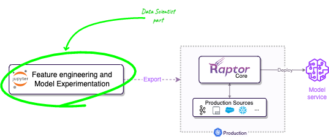

<div id="top"></div>

[![Go Report Card][go-report-card-shield]][go-report-card-url]
[![Go Reference][godoc-shield]][godoc-url]
[![E2E Tests][e2e-tests-shield]][e2e-tests-url]
[![CII Best Practices][best-practices-shield]][best-practices-url]
[![Forks][forks-shield]][forks-url]
[![Stargazers][stars-shield]][stars-url]
[![Issues][issues-shield]][issues-url]
[![MIT License][license-shield]][license-url]
[![LinkedIn][linkedin-shield]][linkedin-url]
<!-- [![Contributors][contributors-shield]][contributors-url] -->

<br />
<div align="center">
    <a href="https://raptor.ml">
        
    </a>

<h3 align="center"><p>From notebook to production</p>Transform your data science to production-ready artifacts</h3>
<br />

  <p align="center">
    Raptor simplifies deploying data science work from a notebook to production; it compiles your python research
    code and takes care of the engineering concerns like scalability and reliability on Kubernetes. Focus on
    the <strong>data science</strong>, RaptorML will take care of the engineering overhead.
    <br />
    <br />
    <a href="https://raptor.ml"><strong>Explore the docs »</strong></a>
    <br />
    <br />
    <a href="https://colab.research.google.com/github/raptor-ml/docs/blob/master/docs/guides/getting-started-with-labsdk.ipynb">Getting started in 5 minutes</a>
    ·
    <a href="https://github.com/raptor-ml/raptor/issues">Report a Bug</a>
    ·
    <a href="https://github.com/raptor-ml/raptor/issues">Request a Feature</a>
  </p>
</div>

[![RaptorML Screen Shot][product-screenshot]][colab-url]

## 🧐 What is Raptor?

Raptor enables data scientists and ML engineers to build and deploy operational models and ML-driven functionality,
**without learning backend engineering**.

With Raptor, you can export your Python research code as standard production artifacts, and deploy them to Kubernetes.
Once you deployed, Raptor optimize data processing and feature calculation for production, deploy models
to Sagemaker or Docker containers, connect to your production data sources, scaling, high availability, caching,
monitoring, and all other backend concerns.

[![Colab][colab-button]][colab-url]

## 😍 Why people *love* Raptor? and how does it change their lives?

**Raptor is made by and for data scientists and ML engineers**. We know how hard it is to build and deploy models to be
an integral part of your products, and we want to make it easier.

Before Raptor, data scientists had to work closely with backend engineers to build a "production version" of their work:
connect to data sources, transform their data with Flink/Spark or even Java, create APIs, dockerizing the model, handle
scaling and high availability, and more.



With Raptor, data scientists can focus *only* on their research and model development, then export their work to
production. Raptor takes care of the rest, including connecting to data sources, transforming the data, deploying and
connecting the model, etc. This means data scientists can focus on what they do best, and Raptor handles the rest.

### ⭐️ Key Features

* **Eliminate serving/training skew**: You can use the same code for training and production to avoid training serving
  skew.
* **Real-time/on-demand**: Raptor optimizes feature calculations and predictions to be performed at the time of request.
* **Seamless Caching and storage**: Raptor uses an integrated caching system, and store your historical data for
  training purposes. So you won't need any other data storage system such as "Feature Store".
* **Turns data science work into production artifacts**: Raptor implements best-practice functionalities of Kubernetes
  solutions, such as scaling, health, auto-recovery, monitoring, logging, and more.
* **Integrates with R&D team**: Raptor extends existing DevOps tools and infrastructure and allows you to connect your
  ML
  research to the rest of your organization's R&D ecosystem, utilizing tools such as CI/CD and monitoring.

<p align="right">(<a href="#top">back to top</a>)</p>

## 🚀 Getting Started

To start, install [Raptor LabSDK](https://pypi.org/project/raptor-labsdk/). The LabSDK is a Python package that help
you develop models and features in a notebooks or IDEs.

```console
pip install raptor-labsdk
```

### ⚡ Quick Example

```python
import pandas as pd
from typing_extensions import TypedDict
from raptor import *


@data_source(
    training_data=pd.read_csv(
        'https://gist.githubusercontent.com/AlmogBaku/8be77c2236836177b8e54fa8217411f2/raw/hello_world_transactions.csv'),
    production_config=StreamingConfig()
)
class BankTransaction(TypedDict):
    customer_id: str
    amount: float
    timestamp: str


# Define features 🧪
@feature(keys='customer_id', data_source=BankTransaction)
@aggregation(function=AggregationFunction.Sum, over='10h', granularity='1h')
def total_spend(this_row: BankTransaction, ctx: Context) -> float:
    """total spend by a customer in the last hour"""
    return this_row['amount']


@feature(keys='customer_id', data_source=BankTransaction)
@freshness(max_age='5h', max_stale='1d')
def amount(this_row: BankTransaction, ctx: Context) -> float:
    """total spend by a customer in the last hour"""
    return this_row['amount']


# Train the model 🤓
@model(
    keys='customer_id',
    input_features=['total_spend+sum'],
    input_labels=[amount],
    model_framework='sklearn',
    model_server='sagemaker-ack',
)
@freshness(max_age='1h', max_stale='100h')
def amount_prediction(ctx: TrainingContext):
    from sklearn.linear_model import LinearRegression
    df = ctx.features_and_labels()
    trainer = LinearRegression()
    trainer.fit(df[ctx.input_features], df[ctx.input_labels])
    return trainer


amount_prediction.export()  # Export to production 🎉
```

This will generate a bunch of artifacts in the `out` directory. The `out` directory also includes a `Makefile` that can
be used for integration in any CI/CD pipeline, or even invoked manually.

[![Colab][colab-button-expand]][colab-url]

<p align="right">(<a href="#top">back to top</a>)</p>

## 🥊 How does Raptor different than ___ ?

### MLOps platforms (MLFlow, Kubeflow, Metaflow, Sagemaker, VertexAI, etc.)

Traditional MLOps platforms are focused on managing the ML resources lifecycle, and are not designed for building
operational
models and features. Raptor is designed for building operational models and features, and can be integrated with MLOps
platforms.

### Feature Stores (Hopsworks, Feast, etc.)

Feature store is a data storage system that stores pre-computed features for training and online purposes. That means
that you need to orchestrate the pre-computation of the features, store them, connect them to your model, and write
ad-hoc backend code.

Raptor takes a radically different approach. You focus on the model, and Raptor takes care of the rest. Raptor has a
built-in caching system that allows you to achieve similar results to a feature store, but without the need to
orchestrate the data pipeline and the model deployment directly.

### Model Servers (Sagemaker, BentoML, KServe, etc.)

Model servers are designed for serving models in production. They are not designed for building models and features for
production. In fact, Raptor integrates seamlessly with Model Servers(such as Sagemaker, BentoML, etc.) to serve your
models.

## 💡 How does it work?

The work with Raptor starts in your research phase in your notebook or IDE. Raptor allows you to write your ML work in a
translatable way for production purposes.

Models and Features in Raptor are composed of a declarative part(via Python's decorators) and a function code. This
way, Raptor can translate the heavy-lifting engineering concerns(such as aggregations or caching) by implementing the
"declarative part", and optimize the implementation for production.

![Features are composed from a declarative part and a function code][feature-py-def]

After you are satisfied with your research results, "export" these definitions, and deploy it to Kubernetes using
standard tools; Once deployed, Raptor Core(the server-side part) is extending Kubernetes with the ability to implement
them. It takes care of the engineering concerns by managing and controlling Kubernetes-native resources such as
deployments to connect your production data sources and run your business logic at scale.

You can read more about Raptor's architecture in [the docs][docs-url].

<p align="right">(<a href="#top">back to top</a>)</p>

## ⎈ Production Installation

**Raptor installation is not required for training purposes**.
You only need to install Raptor *when deploying to production* (or staging).

Learn more about production installation at [the docs][docs-url].

### 🏗️ Prerequisites

1. Kubernetes cluster
2. Redis server (> 2.8.9)
3. Optional: Snowflake or S3 bucket (to record historical data for retraining purposes)

<p align="right">(<a href="#top">back to top</a>)</p>


<!-- ROADMAP -->

## 🏔 Roadmap

- [ ] S3 historical storage plugins
    - [x] S3 storing
    - [ ] S3 fetching data - Spark
- [ ] Deploy models to model servers
    - [x] Sagemaker ACK
    - [ ] Seldon
    - [ ] Kubeflow
    - [ ] KFServing
    - [ ] Standalone
- [ ] Large-scale training
- [ ] Support more data sources
    - [x] Kafka
    - [x] GCP Pub/Sub
    - [x] Rest
    - [ ] Snowflake
    - [ ] BigQuery
    - [ ] gRPC
    - [ ] Redis
    - [ ] Postgres
    - [ ] GraphQL

See the [open issues](https://github.com/raptor-ml/raptor/issues) for a full list of proposed features (and known
issues)
.

<p align="right">(<a href="#top">back to top</a>)</p>


<!-- CONTRIBUTING -->

## 👷‍ Contributing

Contributions make the open-source community a fantastic place to learn, inspire, and create. Any contributions you make
are **greatly appreciated** (not only code! but also documenting, blogging, or giving us feedback) 😍.

Please fork the repo and create a pull request if you have a suggestion. You can also simply open an issue and choose "
Feature Request" to give us some feedback.

**Don't forget to give the project a star! ⭐️**

For more information about contributing code to the project, read the [`CONTRIBUTING.md`](./CONTRIBUTING.md) file.

<p align="right">(<a href="#top">back to top</a>)</p>


<!-- LICENSE -->

## 📃 License

Distributed under the Apache2 License. Read the `LICENSE` file for more information.

<p align="right">(<a href="#top">back to top</a>)</p>

## 👫 Joining the community

<p align="right">(<a href="#top">back to top</a>)</p>

[godoc-shield]: https://pkg.go.dev/badge/github.com/raptor-ml/raptor.svg

[godoc-url]: https://pkg.go.dev/github.com/raptor-ml/raptor

[contributors-shield]: https://img.shields.io/github/contributors/raptor-ml/raptor.svg?style=flat

[contributors-url]: https://github.com/raptor-ml/raptor/graphs/contributors

[forks-shield]: https://img.shields.io/github/forks/raptor-ml/raptor.svg?style=flat

[forks-url]: https://github.com/raptor-ml/raptor/network/members

[stars-shield]: https://img.shields.io/github/stars/raptor-ml/raptor.svg?style=flat

[stars-url]: https://github.com/raptor-ml/raptor/stargazers

[issues-shield]: https://img.shields.io/github/issues/raptor-ml/raptor.svg?style=flat

[issues-url]: https://github.com/raptor-ml/raptor/issues

[e2e-tests-shield]: https://img.shields.io/github/actions/workflow/status/raptor-ml/raptor/test-e2e.yml?label=tests

[e2e-tests-url]: https://github.com/raptor-ml/raptor/actions/workflows/test-e2e.yml

[license-shield]: https://img.shields.io/github/license/raptor-ml/raptor.svg?style=flat

[license-url]: https://github.com/raptor-ml/raptor/blob/master/LICENSE.txt

[linkedin-shield]: https://img.shields.io/badge/-LinkedIn-black.svg?style=flat&logo=linkedin&colorB=555

[linkedin-url]: https://linkedin.com/company/raptor-ml

[go-report-card-shield]: https://goreportcard.com/badge/github.com/raptor-ml/raptor

[go-report-card-url]: https://goreportcard.com/report/github.com/raptor-ml/raptor

[best-practices-shield]: https://bestpractices.coreinfrastructure.org/projects/6406/badge

[best-practices-url]: https://bestpractices.coreinfrastructure.org/projects/6406

[colab-button]: https://img.shields.io/badge/-Getting_started_with_Colab-blue?style=for-the-badge&logo=googlecolab
[colab-button-expand]: https://img.shields.io/badge/-see_advanced_example_notebook-blue?style=for-the-badge&logo=googlecolab

[colab-url]: https://colab.research.google.com/github/raptor-ml/docs/blob/master/docs/guides/getting-started-with-labsdk.ipynb

[docs-url]: https://raptor.ml/

[product-screenshot]: .github/demo.gif

[feature-py-def]: .github/feature-py-def.png
